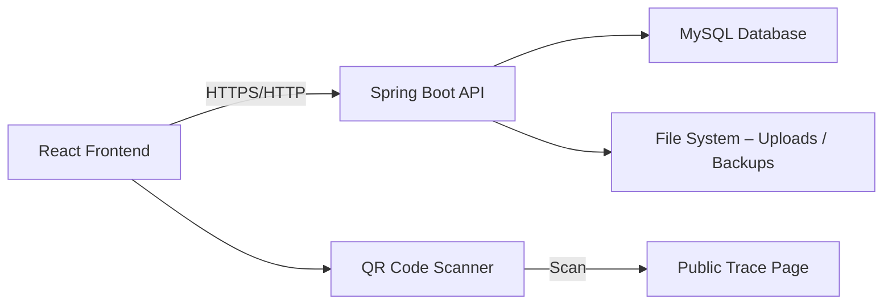

# Nguồn Gốc Số - Nông sản truy xuất nguồn gốc

> **Hệ thống quản lý truy xuất nguồn gốc nông sản** – Minh bạch từ nông trại đến bàn ăn.

---

## 📖 Mục lục

- [Giới thiệu](#-giới-thiệu)
- [Tính năng nổi bật](#-tính-năng-nổi-bật)
- [Công nghệ sử dụng](#-công-nghệ-sử-dụng)
- [Kiến trúc hệ thống](#-kiến-trúc-hệ-thống)
- [Cấu trúc thư mục](#-cấu-trúc-thư-mục)
- [Yêu cầu hệ thống](#-yêu-cầu-hệ-thống)
- [Cài đặt & Chạy dự án](#-cài-đặt--chạy-dự-án)
- [Cấu hình](#-cấu-hình)
- [Phân quyền người dùng](#-phân-quyền-người-dùng)
- [Tài liệu API](#-tài-liệu-api)
- [Kiểm thử](#-kiểm-thử)
- [Triển khai](#-triển-khai)
- [Biến môi trường](#-biến-môi-trường)
- [Quy trình phát triển](#-quy-trình-phát-triển)
- [Đóng góp](#-đóng-góp)
- [Giấy phép](#-giấy-phép)
- [Tác giả](#-tác-giả)

---

## 🌱 Giới thiệu

**Nguồn Gốc Số** là nền tảng quản lý truy xuất nguồn gốc nông sản, giúp các tổ chức (hợp tác xã, doanh nghiệp) số hóa toàn bộ quy trình sản xuất và chuỗi cung ứng.

Hệ thống cho phép:

- **Quản lý tổ chức & thành viên** – Đa tổ chức, phân quyền chi tiết theo vai trò.
- **Khai báo vùng trồng & lô sản xuất** – Theo dõi từ khâu gieo trồng đến thu hoạch.
- **Nhật ký canh tác & chứng từ** – Ghi nhận hoạt động canh tác kèm hình ảnh, chứng nhận.
- **Chuỗi sự kiện cung ứng** – Thu hoạch, đóng gói, vận chuyển, thu mua.
- **Sinh mã QR & Tem truy xuất** – Mỗi lô hàng có mã duy nhất theo chuẩn GS1 mô phỏng.
- **Tra cứu công khai** – Người tiêu dùng quét mã để xem hành trình sản phẩm.
- **Báo cáo & Phân tích** – Thống kê lượt tra cứu, phân tích vùng trồng, so sánh mùa vụ.
- **Sao lưu & Phục hồi dữ liệu** – Tự động theo lịch, bảo toàn dữ liệu khi có sự cố.

---

## ✨ Tính năng nổi bật

### 👥 Quản lý tổ chức & Thành viên

- Tạo tổ chức (HTX, Doanh nghiệp, Cơ quan quản lý)
- Quản lý thành viên theo vai trò (`VT-01` → `VT-05`)
- Cấp quyền chi tiết (từng chức năng, từng tổ chức)
- Mời thành viên qua email (invitation)

### 📦 Lô sản xuất & Vùng trồng

- Khai báo vùng trồng (tên, vị trí, diện tích)
- Tạo lô sản xuất (nháp → chờ duyệt → đã duyệt)
- Cập nhật thông tin lô, gửi duyệt, phê duyệt
- Gắn tiêu chuẩn chất lượng & chứng nhận

### 📝 Nhật ký canh tác

- Ghi nhật ký hoạt động (bón phân, tưới tiêu, phun thuốc...)
- Đính kèm hình ảnh & chứng từ
- Xem lịch sử canh tác theo thời gian

### 🔗 Chuỗi sự kiện cung ứng

- Ghi sự kiện thu hoạch → chuyển lô sang `HARVESTED`
- Ghi sự kiện đóng gói → chuyển lô sang `PACKAGED`
- Ghi sự kiện vận chuyển (quét mã lô hàng)
- Ghi sự kiện thu mua (doanh nghiệp thu mua – VT-04)

### 🏷️ Mã QR & Lô hàng

- Tạo lô hàng từ lô sản xuất đã đóng gói
- Sinh mã truy xuất trong hạn mức dải mã
- Kích hoạt tem → cho phép tra cứu công khai
- Thu hồi lô hàng khi phát hiện sự cố

### 🔍 Tra cứu công khai

- Người tiêu dùng quét mã QR hoặc nhập mã
- Xem hành trình sản phẩm (dòng sự kiện, bản đồ)
- Xem chứng nhận & tiêu chuẩn đã đạt

### 📊 Báo cáo & Phân tích

- Thống kê lượt quét theo lô, thời gian, vị trí
- Phân tích vùng trồng & so sánh mùa vụ
- Báo cáo ngành cho cán bộ quản lý (VT-05)
- Xuất dữ liệu mở theo lược đồ chuẩn

### 💾 Sao lưu & Phục hồi

- Lịch sao lưu tự động (cron expression)
- Sao lưu thủ công
- Xem lịch sử sao lưu/phục hồi
- Tải xuống file backup
- Phục hồi dữ liệu với chế độ bảo trì & rollback tự động

### 📱 Trải nghiệm di động

- Ghi sự kiện ngoài đồng (mobile-friendly form)
- Quét mã để ghi sự kiện nhanh
- Lưu sự kiện khi mất mạng → đồng bộ sau
- Giao diện tối ưu cho thiết bị di động

---

## 🛠️ Công nghệ sử dụng

### 🔙 Backend

| Thành phần | Công nghệ |
|------------|-----------|
| Ngôn ngữ | Java 21 |
| Framework | Spring Boot 3.5.x |
| Bảo mật | Spring Security 6.x + JWT |
| ORM | Spring Data JPA (Hibernate 6.x) |
| Database | MySQL 8.0 |
| Migration | Flyway 11.x |
| Validation | Jakarta Validation |
| JSON | Jackson 2.x |
| Build tool | Maven 3.x |
| Logging | SLF4J + Logback |

### 🎨 Frontend

| Thành phần | Công nghệ |
|------------|-----------|
| Ngôn ngữ | TypeScript 5.x |
| Framework | React 18.x |
| Build tool | Vite 5.x |
| UI Library | Tailwind CSS 3.x + shadcn/ui |
| Form handling | React Hook Form + Zod |
| HTTP Client | Axios |
| Routing | React Router v6 |
| QR Code | @zxing/browser |
| Charts | Recharts |
| Notifications | Sonner |

### 🐳 DevOps

| Thành phần | Công nghệ |
|------------|-----------|
| Container | Docker + Docker Compose |
| CI/CD | GitHub Actions |
| Monitoring | Spring Boot Actuator |

---

## 🏗️ Kiến trúc hệ thống



### Luồng dữ liệu chính

1. **Người dùng** (VT-02, VT-03) ghi sự kiện → Frontend gọi API → Backend validate, lưu DB, update status.
2. **Mã QR** được sinh từ Backend, lưu đường dẫn file.
3. **Người tiêu dùng** quét mã → truy cập trang công khai → Backend trả về dòng sự kiện.
4. **Sao lưu & Phục hồi** chạy background, sử dụng `mysqldump` và `mysql` CLI.

---

## 📂 Cấu trúc thư mục

```text
nguongocso/
├── backend/
│   ├── src/
│   │   ├── main/
│   │   │   ├── java/vn/nguongocso/
│   │   │   │   ├── auth/           # Xác thực & phân quyền
│   │   │   │   ├── backup/         # Sao lưu & phục hồi
│   │   │   │   ├── common/         # DTO, API Result
│   │   │   │   ├── config/         # Cấu hình (Security, JWT)
│   │   │   │   ├── event/          # Chuỗi sự kiện
│   │   │   │   ├── farm/           # Vùng trồng, lô sản xuất
│   │   │   │   ├── trace/          # Lô hàng, mã truy xuất
│   │   │   │   ├── organization/   # Tổ chức, thành viên
│   │   │   │   ├── report/         # Báo cáo & thống kê
│   │   │   │   ├── notification/   # Thông báo
│   │   │   │   └── permission/     # Quyền hạn
│   │   │   ├── resources/
│   │   │   │   ├── db/migration/   # Flyway scripts
│   │   │   │   ├── application.properties
│   │   │   │   └── application-dev.properties
│   │   └── test/                   # Unit tests
│   ├── pom.xml
│   └── Dockerfile
│
├── frontend/
│   ├── src/
│   │   ├── api/                    # API calls
│   │   ├── assets/                 # Images, fonts
│   │   ├── components/             # Reusable UI
│   │   │   ├── ui/                 # shadcn/ui
│   │   │   ├── layout/             # Header, Sidebar
│   │   │   ├── auth/               # Login, RoleBasedRoute
│   │   │   ├── backup/             # Backup & Restore
│   │   │   └── ...
│   │   ├── hooks/                  # Custom React hooks
│   │   ├── pages/                  # Route pages
│   │   │   ├── admin/              # Admin pages
│   │   │   ├── public/             # Public pages (trace)
│   │   │   └── ...
│   │   ├── types/                  # TypeScript types
│   │   ├── utils/                  # Helpers & validators
│   │   ├── config/                 # App config, roles
│   │   ├── App.tsx
│   │   └── main.tsx
│   ├── index.html
│   ├── package.json
│   ├── tsconfig.json
│   └── vite.config.ts
│
├── docs/
│   ├── API/
│   │   └── API_DOCS.md
│   ├── AI_DESIGN_SYSTEM.md
│   └── DATABASE_SCHEMA.md
│
├── docker/
│   ├── docker-compose.yml
│   └── mysql/
│
├── .env.example
├── .gitignore
└── README.md
```

---

## 📋 Yêu cầu hệ thống

| Thành phần | Phiên bản tối thiểu |
|------------|---------------------|
| Java | 21 |
| Node.js | 22.x |
| MySQL | 8.0 |
| Maven | 3.9.x |
| Git | 2.x |
| Docker (optional) | 24.x |

---

## ⚙️ Cài đặt & Chạy dự án

### 1. Clone repository

```bash
git clone https://github.com/your-org/nguongocso.git
cd nguongocso
```

### 2. Backend

```bash
cd backend

# Cài đặt dependencies
mvn clean install

# Chạy ứng dụng (mặc định port 8080)
mvn spring-boot:run -Dspring-boot.run.profiles=dev
```

Hoặc chạy với Docker:

```bash
docker build -t nguongocso-backend .
docker run -p 8080:8080 nguongocso-backend
```

### 3. Frontend

```bash
cd frontend

# Cài đặt dependencies
npm install

# Chạy dev server (mặc định port 5173)
npm run dev
```

### 4. Database

Tạo database MySQL:

```sql
CREATE DATABASE nguon_goc_so CHARACTER SET utf8mb4 COLLATE utf8mb4_unicode_ci;
```

Sau đó chạy Flyway (mặc định tự động chạy khi start backend).

---

## 🔧 Cấu hình

### Backend – `application-dev.properties`

```properties
# Database
spring.datasource.url=jdbc:mysql://localhost:3306/nguon_goc_so
spring.datasource.username=root
spring.datasource.password=your_password

# JWT
app.jwt.secret=YourSecretKey
app.jwt.expiration=86400000

# Upload
app.upload.base-dir=./uploads
app.upload.farm-log.max-size=5242880

# Backup
app.backup.local-dir=./backups
app.backup.mysql-dump-path=mysqldump
app.backup.retention-count=30

# Logging
logging.level.vn.nguongocso=DEBUG
```

### Frontend – `.env`

```env
VITE_API_URL=http://localhost:8080/api/v1
VITE_APP_NAME=Nguồn gốc số
```

---

## 👥 Phân quyền người dùng

| Role | Mô tả | Quyền chính |
|------|-------|-------------|
| **VT-01** | Quản trị viên nền tảng | Quản lý tổ chức, dải mã, danh mục, backup/restore |
| **VT-02** | Quản lý hợp tác xã | Quản lý vùng trồng, lô sản xuất, thành viên, duyệt lô |
| **VT-03** | Người ghi sự kiện | Ghi nhật ký canh tác, sự kiện chuỗi (thu hoạch, đóng gói, vận chuyển) |
| **VT-04** | Doanh nghiệp thu mua | Ghi sự kiện thu mua, xuất hồ sơ |
| **VT-05** | Cán bộ quản lý ngành | Xem báo cáo, phân tích, xuất dữ liệu mở |

Mỗi role được gán quyền chi tiết (permission) trên từng resource.

---

## 📚 Tài liệu API

Sau khi chạy backend, truy cập:

- **Swagger UI:** `http://localhost:8080/swagger-ui/index.html`
- **OpenAPI JSON:** `http://localhost:8080/v3/api-docs`

Hoặc xem file: [`docs/API/API_DOCS.md`](docs/API/API_DOCS.md)

---

## 🧪 Kiểm thử

### Backend

```bash
cd backend
mvn test
```

### Frontend

```bash
cd frontend
npm run test
```

### Kiểm thử E2E

```bash
npm run test:e2e
```

---

## 🚀 Triển khai

### Docker Compose

```bash
docker-compose -f docker/docker-compose.yml up -d
```

### Production Build

**Backend:**

```bash
mvn clean package -Pproduction
java -jar target/nguongocso-*.jar
```

**Frontend:**

```bash
npm run build
# Output in dist/ folder, deploy to Nginx/AWS S3/CDN
```

### Environment Variables for Production

| Variable | Description |
|----------|-------------|
| `DB_HOST` | Database host |
| `DB_PORT` | Database port |
| `DB_NAME` | Database name |
| `DB_USERNAME` | Database username |
| `DB_PASSWORD` | Database password |
| `JWT_SECRET` | JWT signing secret |
| `APP_UPLOAD_BASE_DIR` | Upload directory |
| `BACKUP_LOCAL_DIR` | Backup directory |
| `BACKUP_RETENTION_COUNT` | Number of backups to keep |

---

## 🌿 Quy trình phát triển

### Branch Strategy

```text
main          → Production
develop       → Integration
feature/*     → New features
bugfix/*      → Bug fixes
release/*     → Release preparation
hotfix/*      → Emergency fixes
```

### Git Workflow

1. **Checkout develop:** `git checkout develop`
2. **Create feature branch:** `git checkout -b feature/NCL-XX-short-desc`
3. **Commit changes:** `git commit -m "feat: add something"`
4. **Push:** `git push origin feature/NCL-XX-short-desc`
5. **Create Pull Request** to `develop`

### Commit Convention

```text
feat: Add QR code generation
fix: Fix permission check for VT-03
docs: Update API documentation
style: Format code with Prettier
refactor: Extract reusable components
test: Add unit tests for BackupService
chore: Update dependencies
```

---

## 🤝 Đóng góp

1. Fork repository
2. Tạo branch feature của bạn
3. Commit thay đổi
4. Push lên branch của bạn
5. Tạo Pull Request

Mọi đóng góp đều được chào đón!

---

## 📄 Giấy phép

MIT License – xem file [LICENSE](LICENSE) để biết chi tiết.

---

## 👨‍💻 Tác giả

- **Nguyễn Văn A** – *Backend Lead* – [@email](mailto:a@example.com)
- **Trần Văn B** – *Frontend Lead* – [@email](mailto:b@example.com)

---

## 📮 Liên hệ

- **Email:** support@nguongocso.com
- **Website:** [https://nguongocso.com](https://nguongocso.com)
- **GitHub:** [https://github.com/your-org/nguongocso](https://github.com/your-org/nguongocso)

---

> **Xây dựng niềm tin – Minh bạch từ nông trại đến bàn ăn.** 🌾
