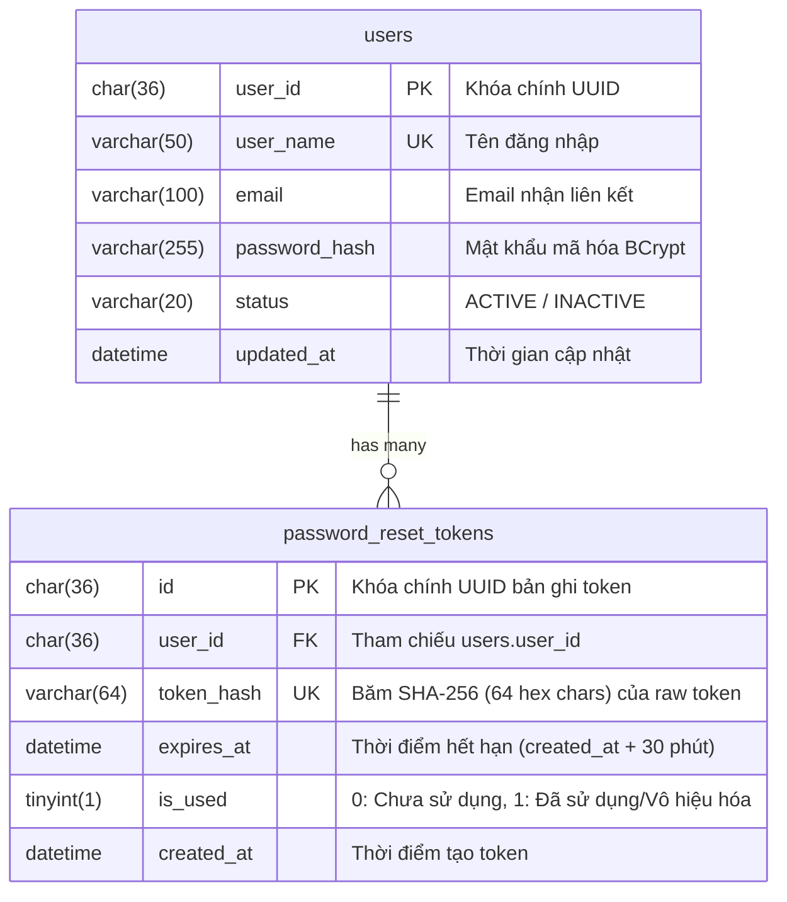

# TÀI LIỆU THIẾT KẾ VÀ ĐẶC TẢ API (API DOCS)
## USER STORY: NCL-01-CN-008 — ĐẶT LẠI MẬT KHẨU KHI QUÊN

---

## 📝 Nhật ký thay đổi (Changelog)

| Ngày | Phiên bản | Nhánh Git (Git Branch) | Nội dung thay đổi | Người thực hiện |
| :--- | :---: | :--- | :--- | :--- |
| **2026-08-27** | `v1.1.0` | `feature/NCL-01-CN-008-forgot-password` | Bổ sung Modal Popup chỉ dẫn khi chưa có email, đồng bộ cảnh báo Hộp thông báo/Chấm đỏ Sidebar-Header, API Profile & cập nhật bảng mã lỗi chuẩn | Fullstack Development Team |
| **2026-08-26** | `v1.0.0` | `feature/NCL-01-CN-008-forgot-password` | Khởi tạo tài liệu đặc tả API Đặt lại mật khẩu khi quên (US NCL-01-CN-008, QTN-33) | Backend Development Team |

---

## 1. Tổng quan User Story & Nghiệp vụ (Business Overview)

| Thuộc tính | Chi tiết |
| :--- | :--- |
| **Mã User Story** | `NCL-01-CN-008` (Thuộc Epic `NCL-01`: Quản lý tài khoản và phân quyền đa tổ chức) |
| **Nhánh Git (Git Branch)** | `feature/NCL-01-CN-008-forgot-password` |
| **Tên tính năng** | Đặt lại mật khẩu khi quên |
| **Actor (Tác nhân)** | Người ghi sự kiện (VT-03 - Nông dân/HTX), Quản lý hợp tác xã (VT-02), Doanh nghiệp thu mua (VT-04), Cơ quan kiểm định (VT-05), Quản trị viên hệ thống (VT-01) |
| **Mô tả Story** | *Là Người ghi sự kiện / Thành viên tổ chức, tôi muốn tự đặt lại mật khẩu khi quên, để tiếp tục ghi dữ liệu ngay trong ngày thay vì chờ quản trị viên cấp lại tài khoản.* |
| **Quy tắc nghiệp vụ** | `QTN-33`: Liên kết đặt lại mật khẩu dùng một lần và có thời hạn (30 phút). Số lần yêu cầu trong một giờ bị giới hạn (tối đa 5 lần/giờ/tài khoản). |
| **Tiêu chí nghiệm thu** | `NCL-01-CN-008-TC-01` (Luồng thành công), `TC-02` (Quá hạn 30p), `TC-03` (Token đã dùng), `TC-04` (Mật khẩu yếu/trùng mật khẩu cũ), `TC-05` (Lưu lịch sử & chấm dứt phiên cũ). |

---

## 2. Phân tích Cơ sở Dữ liệu (Database Schema Analysis)

Chức năng sử dụng bảng mới **`password_reset_tokens`** (Flyway migration `V38`) liên kết trực tiếp với bảng **`users`**.

### 2.1. Sơ đồ Quan hệ Thực thể (ERD)



### 2.2. Chi tiết Cấu trúc Bảng `password_reset_tokens`

```sql
CREATE TABLE IF NOT EXISTS password_reset_tokens (
    id CHAR(36) NOT NULL,
    user_id CHAR(36) NOT NULL,
    token_hash VARCHAR(64) NOT NULL,
    expires_at DATETIME NOT NULL,
    is_used TINYINT(1) NOT NULL DEFAULT 0,
    created_at DATETIME NOT NULL,
    CONSTRAINT pk_password_reset_tokens PRIMARY KEY (id),
    CONSTRAINT fk_password_reset_tokens_user FOREIGN KEY (user_id) REFERENCES users (user_id) ON DELETE CASCADE,
    CONSTRAINT uk_password_reset_token_hash UNIQUE (token_hash)
) ENGINE=InnoDB DEFAULT CHARSET=utf8mb4 COLLATE=utf8mb4_unicode_ci;
```

### 2.3. Thiết kế Chỉ mục (Indexes & Optimizations)

| Tên Index | Các cột (Columns) | Loại Index | Mục đích tối ưu |
| :--- | :--- | :--- | :--- |
| `PRIMARY` | `id` | Primary Key | Truy vấn/xóa theo ID bản ghi. |
| `uk_password_reset_token_hash` | `token_hash` | Unique Index | Đảm bảo tính duy nhất tuyệt đối và tìm kiếm nhanh khi xác thực token. |
| `idx_prt_user_created` | `user_id, created_at` | Composite Index | Tối ưu kiểm tra **Rate Limiting** (đếm số lần yêu cầu của user trong 1 giờ qua). |
| `idx_prt_hash_used_expires` | `token_hash, is_used, expires_at` | Composite Index | Tối ưu câu lệnh **Atomic Update** và validate token còn hạn (`is_used = 0 AND expires_at > NOW()`). |

---

## 3. Kiến trúc Bảo mật & Nguyên tắc Vận hành (Security Architecture)

1. **Chống dò quét tài khoản (Anti-Account Enumeration):**
   * Endpoint `POST /api/v1/auth/forgot-password` luôn trả về HTTP `200 OK` với thông điệp chung nếu tài khoản không tồn tại trên hệ thống.
   * Tuyệt đối không để lộ thông tin tài khoản không tồn tại qua mã lỗi nhằm ngăn chặn tấn công liệt kê người dùng (user enumeration).
2. **Bảo vệ Token (Token Security):**
   * Sinh `rawToken` ngẫu nhiên chuẩn mật mã 32 bytes (256-bit entropy, Base64 URL-safe).
   * **Chỉ gửi `rawToken` qua Email.**
   * **Database chỉ lưu trữ chuỗi băm `SHA-256(rawToken)`** (độ dài 64 ký tự). Ngay cả khi lộ cơ sở dữ liệu, kẻ tấn công cũng không thể sử dụng để đổi mật khẩu.
   * `rawToken` không được ghi vào logs hệ thống hoặc trả về qua response API.
3. **Chống tấn công từ chối dịch vụ / Spam (Rate Limiting):**
   * Mỗi tài khoản chỉ được yêu cầu tối đa **5 lần / 1 giờ**. Nếu vượt quá, backend âm thầm bỏ qua việc gửi mail để tránh spam hộp thư.
4. **Vòng đời Token & Chống Race Condition (Atomic Token Invalidation):**
   * Thời hạn hiệu lực: **30 phút**.
   * Khi người dùng yêu cầu mã mới $\rightarrow$ mọi token cũ chưa dùng của user đó bị đánh dấu `is_used = 1`.
   * Khi đặt lại mật khẩu, backend thực thi Atomic Update:
     ```sql
     UPDATE password_reset_tokens 
     SET is_used = TRUE 
     WHERE token_hash = ? AND is_used = FALSE AND expires_at > NOW()
     ```
     Nếu số dòng cập nhật = 0 (do token đã dùng hoặc hết hạn hoặc có request đồng thời), giao dịch bị hủy và báo lỗi.
5. **Chính sách mật khẩu (Password Policy):**
   * Độ dài từ 8 đến 50 ký tự.
   * Bắt buộc có ít nhất 1 chữ hoa, 1 chữ thường, 1 chữ số, 1 ký tự đặc biệt (`PASSWORD_REGEX`).
   * Không được trùng với mật khẩu hiện tại (`passwordEncoder.matches`).

---

## 4. Đặc tả Chi tiết API Endpoints (API Specification)

**Base URL:**
```text
/api/v1/auth
```

**Cấu trúc Response Chuẩn (`ApiResult<T>`):**
```json
{
  "success": true,
  "status": 200,
  "data": {},
  "message": "Thông điệp (nếu có)",
  "timestamp": "2026-08-27T08:00:00.000Z"
}
```

---

### 4.1. API Yêu cầu Đặt lại Mật khẩu (Forgot Password)

Tiếp nhận tên đăng nhập hoặc email, tạo mã token bảo mật và kích hoạt gửi email hướng dẫn.

* **Endpoint:** `POST /api/v1/auth/forgot-password`
* **Xác thực:** Public (`permitAll` - Không yêu cầu JWT)
* **Rate Limit:** Tối đa 5 yêu cầu / 1 giờ / 1 tài khoản

#### Request Body (`application/json`):
```json
{
  "emailOrUsername": "nongdan01"
}
```

| Trường | Kiểu | Bắt buộc | Ràng buộc | Mô tả |
| :--- | :--- | :---: | :--- | :--- |
| `emailOrUsername` | `string` | **Có** | Max 100 ký tự | Tên đăng nhập hoặc địa chỉ email đã đăng ký |

#### Response Success (`200 OK`):
```json
{
  "success": true,
  "status": 200,
  "data": null,
  "message": null,
  "timestamp": "2026-08-27T08:05:00.123Z"
}
```

#### Response Lỗi Chưa cấu hình Email (`400 Bad Request`):
```json
{
  "success": false,
  "status": 400,
  "message": "Tài khoản chưa được cập nhật địa chỉ email trên hệ thống để thực hiện đặt lại mật khẩu.",
  "timestamp": "2026-08-27T08:05:00.123Z"
}
```

#### Response Validation Error (`400 Bad Request`):
```json
{
  "success": false,
  "status": 400,
  "message": "Dữ liệu không hợp lệ",
  "errors": {
    "emailOrUsername": "Vui lòng nhập tên đăng nhập hoặc email"
  },
  "timestamp": "2026-08-27T08:05:00.123Z"
}
```

---

### 4.2. API Kiểm tra Token Đặt lại Mật khẩu (Validate Reset Token)

Kiểm tra tính hợp lệ và thời hạn của token khi người dùng click vào link trong email trước khi cho phép nhập mật khẩu mới.

* **Endpoint:** `GET /api/v1/auth/reset-password/validate`
* **Xác thực:** Public (`permitAll` - Không yêu cầu JWT)

#### Query Parameters:

| Tên tham số | Kiểu | Bắt buộc | Mô tả |
| :--- | :--- | :---: | :--- |
| `token` | `string` | **Có** | Chuỗi raw token từ URL query parameter |

#### Ví dụ Request:
```http
GET /api/v1/auth/reset-password/validate?token=XsGvpcdO1fGmsDgka-aBR5MLOrUM6nvcDzod4NnhNWs
```

#### Response Token Hợp lệ (`200 OK`):
```json
{
  "success": true,
  "status": 200,
  "data": {
    "valid": true,
    "message": "Liên kết hợp lệ"
  },
  "timestamp": "2026-08-27T08:10:00.123Z"
}
```

#### Response Token Không hợp lệ / Hết hạn (`200 OK`):
```json
{
  "success": true,
  "status": 200,
  "data": {
    "valid": false,
    "message": "Liên kết đặt lại mật khẩu đã hết hạn hoặc không còn hiệu lực"
  },
  "timestamp": "2026-08-27T08:10:00.123Z"
}
```

---

### 4.3. API Đặt lại Mật khẩu Mới (Reset Password)

Xác thực token, kiểm tra mật khẩu mới và cập nhật mật khẩu người dùng vào hệ thống.

* **Endpoint:** `POST /api/v1/auth/reset-password`
* **Xác thực:** Public (`permitAll` - Không yêu cầu JWT)

#### Request Body (`application/json`):
```json
{
  "token": "XsGvpcdO1fGmsDgka-aBR5MLOrUM6nvcDzod4NnhNWs",
  "newPassword": "SecurePassword@2026",
  "confirmPassword": "SecurePassword@2026"
}
```

| Trường | Kiểu | Bắt buộc | Ràng buộc | Mô tả |
| :--- | :--- | :---: | :--- | :--- |
| `token` | `string` | **Có** | Raw token từ email | Token xác thực quyền đổi mật khẩu |
| `newPassword` | `string` | **Có** | 8–50 ký tự, chữ hoa, thường, số, ký tự đặc biệt | Mật khẩu mới |
| `confirmPassword` | `string` | **Có** | Khớp chính xác với `newPassword` | Nhập lại mật khẩu mới |

#### Response Success (`200 OK`):
```json
{
  "success": true,
  "status": 200,
  "data": null,
  "message": null,
  "timestamp": "2026-08-27T08:15:00.123Z"
}
```

#### Response Lỗi Nghiệp vụ (`400 Bad Request`):

1. **Mật khẩu xác nhận không khớp:**
```json
{
  "success": false,
  "status": 400,
  "message": "Xác nhận mật khẩu mới không khớp",
  "timestamp": "2026-08-27T08:15:00.123Z"
}
```

2. **Mật khẩu mới trùng mật khẩu cũ:**
```json
{
  "success": false,
  "status": 400,
  "message": "Mật khẩu mới không được trùng với mật khẩu hiện tại",
  "timestamp": "2026-08-27T08:15:00.123Z"
}
```

3. **Liên kết hết hạn hoặc đã sử dụng:**
```json
{
  "success": false,
  "status": 400,
  "message": "Liên kết đặt lại mật khẩu đã hết hạn hoặc không còn hiệu lực",
  "timestamp": "2026-08-27T08:15:00.123Z"
}
```

---

### 4.4. API Lấy Thông tin Tài khoản Hiện tại (Get Current User Profile)

Lấy thông tin người dùng đang đăng nhập bao gồm quyền, tổ chức, số điện thoại và email mới nhất từ database.

* **Endpoint:** `GET /api/v1/auth/me`
* **Xác thực:** Yêu cầu Bearer Access JWT
* **Phân quyền:** Dành cho tất cả người dùng đã xác thực (`isAuthenticated()`)

#### Response Success (`200 OK`):
```json
{
  "success": true,
  "status": 200,
  "data": {
    "userId": "c13bde2c-5360-4f1d-897b-d744f35084af",
    "username": "nongdan01",
    "fullName": "Trần Văn Hạnh",
    "phone": "0987654321",
    "email": "nongdan@gmail.com",
    "roleCode": "VT-03",
    "roleName": "Người ghi sự kiện",
    "organizationId": "57dcf668-ad9e-420d-8905-5ae049e88a4e",
    "organizationCode": "HTX-XANH",
    "organizationName": "Hợp tác xã Nông nghiệp Xanh",
    "organizationType": "COOPERATIVE",
    "permissions": ["farm_log:create", "farm_log:view"]
  },
  "timestamp": "2026-08-27T08:18:00.123Z"
}
```

---

### 4.5. API Cập nhật Hồ sơ & Bổ sung Email Người dùng (Update Profile & Email)

Hỗ trợ người dùng (`VT-02` đến `VT-05`) chủ động cập nhật thông tin email, số điện thoại cá nhân để phục vụ luồng nhận mã đặt lại mật khẩu.

* **Endpoint:** `PUT /api/v1/auth/profile`
* **Xác thực:** Yêu cầu Bearer Access JWT
* **Phân quyền:** Dành cho các vai trò `VT-02`, `VT-03`, `VT-04`, `VT-05` (`@PreAuthorize("isAuthenticated()")`)

#### Request Body (`application/json`):
```json
{
  "phone": "0987654321",
  "email": "nongdan@gmail.com"
}
```

| Trường | Kiểu | Bắt buộc | Ràng buộc | Mô tả |
| :--- | :--- | :---: | :--- | :--- |
| `phone` | `string` | Không | 10–11 chữ số hợp lệ | Số điện thoại liên lạc của người dùng |
| `email` | `string` | Không | Chuẩn định dạng email | Email dùng để nhận liên kết đặt lại mật khẩu |

#### Response Success (`200 OK`):
```json
{
  "success": true,
  "status": 200,
  "data": {
    "userId": "c13bde2c-5360-4f1d-897b-d744f35084af",
    "username": "nongdan01",
    "fullName": "Trần Văn Hạnh",
    "phone": "0987654321",
    "email": "nongdan@gmail.com",
    "roleCode": "VT-03",
    "roleName": "Người ghi sự kiện",
    "organizationId": "57dcf668-ad9e-420d-8905-5ae049e88a4e",
    "organizationCode": "HTX-XANH",
    "organizationName": "Hợp tác xã Nông nghiệp Xanh",
    "organizationType": "COOPERATIVE",
    "permissions": ["farm_log:create", "farm_log:view"]
  },
  "message": "Cập nhật hồ sơ thành công",
  "timestamp": "2026-08-27T08:20:00.123Z"
}
```

---

## 5. Bảng Ánh xạ Mã lỗi Nghiệp vụ (Error Codes & Responses)

| HTTP Status | Trường hợp lỗi | Message phản hồi |
| :---: | :--- | :--- |
| `400` | Input trống / sai định dạng | *"Vui lòng nhập tên đăng nhập hoặc email"* / *"Mật khẩu không đạt độ mạnh yêu cầu"* |
| `400` | Tài khoản chưa cấu hình email | *"Tài khoản chưa được cập nhật địa chỉ email trên hệ thống để thực hiện đặt lại mật khẩu."* |
| `400` | Tài khoản đang bị khóa/ngưng hoạt động | *"Tài khoản đang bị khóa hoặc ngưng hoạt động. Vui lòng liên hệ quản trị viên."* |
| `400` | Mật khẩu xác nhận lệch | *"Xác nhận mật khẩu mới không khớp"* |
| `400` | Mật khẩu mới trùng mật khẩu cũ | *"Mật khẩu mới không được trùng với mật khẩu hiện tại"* |
| `400` | Token sai, đã dùng hoặc quá 30p | *"Liên kết đặt lại mật khẩu đã hết hạn hoặc không còn hiệu lực"* |

---

## 6. Mẫu Email Gửi Người Dùng (Email Notification Template)

* **Tiêu đề:** `Yêu cầu đặt lại mật khẩu - Nguồn Gốc Số`
* **Người gửi:** `Nguồn Gốc Số - Hệ Thống Truy Xuất Nguồn Gốc <no-reply@nguongocso.vn>`
* **Định dạng:** HTML chuẩn Responsive, mã màu thương hiệu `#059669` (Emerald Green).
* **Nội dung chính:**
  * Lời chào cá nhân hóa theo họ tên (`user.fullName`).
  * Thông báo tiếp nhận yêu cầu đặt lại mật khẩu.
  * Nút bấm hành động (CTA Button): **"Đặt lại mật khẩu"** dẫn tới `${FRONTEND_URL}/reset-password?token=${rawToken}`.
  * Cảnh báo thời hạn: Có hiệu lực trong **30 phút**.
  * Cảnh báo bảo mật: Nếu không phải bạn yêu cầu, vui lòng bỏ qua email này.

---

## 7. Đồng bộ Giao diện & Trải nghiệm Người dùng (Frontend UX / UI Synchronization)

Để đảm bảo người dùng không gặp sự cố quên mật khẩu khi chưa có email, hệ thống thiết kế cơ chế cảnh báo và chỉ dẫn xuyên suốt:

1. **Cảnh báo trong Hộp thông báo (`NotificationBell` / `NotificationPanel` / `NotificationsPage`):**
   * Đối với các vai trò có quyền truy cập hồ sơ (`VT-02` $\rightarrow$ `VT-05`), nếu `user.email` trống, hệ thống hiển thị mục thông báo nổi bật màu cam `Cần bổ sung địa chỉ email`.
   * Bấm vào thông báo sẽ điều hướng trực tiếp đến trang `/profile`.
2. **Chấm đỏ chỉ báo (`Red Dot Indicator`):**
   * **Sidebar:** Hiển thị 1 chấm đỏ duy nhất (`bg-red-500 ring-2 ring-white`) tại bên phải mục **"Hồ sơ người dùng"**. Khi nhóm **"Hệ thống"** bị thu gọn (`!expanded`), chấm đỏ sẽ hiển thị trên thanh tiêu đề nhóm "Hệ thống".
   * **Header:** Hiển thị chấm đỏ trên Avatar người dùng và mục "Hồ sơ người dùng" trong menu dropdown.
   * Khi người dùng cập nhật email thành công, toàn bộ chấm đỏ và thông báo sẽ tự động biến mất.
3. **Cơ chế Reset Chấm đỏ theo Phiên Đăng nhập (Session-based Unread):**
   * Trạng thái đã đọc thông báo nhắc email được lưu trong `sessionStorage` (`session_read_email_notice_${userId}`).
   * Khi người dùng đăng xuất và đăng nhập lại ở phiên làm việc mới, nếu tài khoản vẫn chưa có email, chấm đỏ trên chuông thông báo sẽ **luôn xuất hiện trở lại** để nhắc nhở.
4. **Modal Popup Chỉ dẫn khi Quên mật khẩu mà chưa có Email:**
   * Khi người dùng nhập tên đăng nhập tại trang `/forgot-password`, nếu tài khoản chưa có email, hệ thống sẽ mở **Modal Popup** trực quan với nội dung:
     * **Tiêu đề:** `Tài khoản chưa cập nhật email`
     * **Nguyên nhân:** Do chưa cập nhật email nên không thể tự đặt lại mật khẩu.
     * **Cách xử lý:** Hướng dẫn liên hệ người quản lý tổ chức/HTX (người đã tạo tài khoản) để cấp lại mật khẩu trực tiếp.
     * **Lưu ý:** Nhắc nhở vào mục *Hồ sơ người dùng* cập nhật email sau khi đăng nhập lại thành công.

---

## 8. Danh mục Mã nguồn Tham chiếu (Source Code References)

### Backend:
* `backend/src/main/java/vn/nguongocso/auth/controller/AuthController.java`
* `backend/src/main/java/vn/nguongocso/auth/service/PasswordResetService.java`
* `backend/src/main/java/vn/nguongocso/auth/service/impl/PasswordResetServiceImpl.java`
* `backend/src/main/java/vn/nguongocso/auth/service/AuthService.java`
* `backend/src/main/java/vn/nguongocso/auth/entity/PasswordResetToken.java`
* `backend/src/main/java/vn/nguongocso/auth/repository/PasswordResetTokenRepository.java`
* `backend/src/main/java/vn/nguongocso/auth/dto/request/ForgotPasswordRequest.java`
* `backend/src/main/java/vn/nguongocso/auth/dto/request/ResetPasswordRequest.java`
* `backend/src/main/java/vn/nguongocso/auth/dto/request/UpdateUserProfileRequest.java`
* `backend/src/main/java/vn/nguongocso/auth/dto/response/ValidateResetTokenResponse.java`
* `backend/src/main/java/vn/nguongocso/auth/dto/response/UserProfileResponse.java`
* `backend/src/main/resources/db/migration/schema/V38__create_password_reset_tokens.sql`
* `backend/src/test/java/vn/nguongocso/unit/auth/PasswordResetServiceTest.java`
* `backend/src/test/java/vn/nguongocso/unit/auth/PasswordResetIntegrationTest.java`
* `backend/src/test/java/vn/nguongocso/unit/auth/AuthControllerTest.java`

### Frontend:
* `frontend/src/pages/auth/ForgotPasswordPage.tsx`
* `frontend/src/pages/auth/ResetPasswordPage.tsx`
* `frontend/src/pages/profile/UserProfilePage.tsx`
* `frontend/src/pages/notification/NotificationsPage.tsx`
* `frontend/src/components/auth/ForgotPasswordForm.tsx`
* `frontend/src/components/auth/ResetPasswordForm.tsx`
* `frontend/src/components/notification/NotificationBell.tsx`
* `frontend/src/components/notification/NotificationPanel.tsx`
* `frontend/src/components/layout/Sidebar.tsx`
* `frontend/src/components/layout/Header.tsx`
* `frontend/src/contexts/AuthContext.tsx`
* `frontend/src/api/authApi.ts`
* `frontend/src/types/auth.ts`
* `frontend/src/utils/validators.ts`
