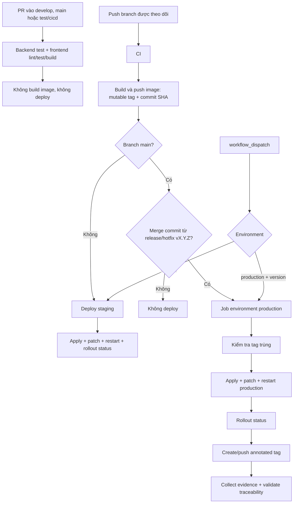

# Rà soát luồng CI/CD (NCL-943)

Tài liệu này mô tả nguyên trạng `.github/workflows/ci-cd.yml`, ghi nhận các điểm
bất hợp lý và tách riêng những thay đổi cần nhóm thống nhất. NCL-943 không mặc
định thay đổi chính sách release hoặc cấu hình Kubernetes đang vận hành.

## Phạm vi và mức độ xác minh

- Nguồn đối chiếu: workflow, manifest và tài liệu trong repository.
- Pull request chỉ chứng minh được các job CI đã chạy; job deploy bị bỏ qua không
  phải bằng chứng CD hoạt động.
- Chưa chạy deploy staging hoặc production trong lần rà soát này.
- Chưa kiểm tra trực tiếp namespace, secret, ingress, TLS, database hoặc
  protection rules trên cluster/GitHub Environment.
- Thay đổi thực thi duy nhất của NCL-943 là bổ sung `npm test` vào frontend CI.

## Ma trận trigger hiện tại

| Sự kiện | CI | Build/push image | Deploy hiện tại |
|---|---:|---:|---|
| Pull request vào `develop`, `main`, `test/cicd` | Có | Không | Không |
| Push `develop` | Có | Có | Staging |
| Push `release/**`, `hotfix/**`, `test/cicd` | Có | Có | Staging |
| Push `main` thông thường | Có | Có | Không |
| Merge `release/vX.Y.Z` hoặc `hotfix/vX.Y.Z` vào `main` bằng merge commit phù hợp | Có | Có | Production |
| Chạy thủ công, chọn `staging` | Có | Có | Staging |
| Chạy thủ công, chọn `production` và nhập version | Có | Có | Production |

Workflow hiện không giới hạn manual production ở branch `main` và chưa xác minh
`release_version` theo SemVer. Nếu chọn production nhưng bỏ trống version, image
vẫn có thể được build với tag thuận tiện `production` nhưng không có job deploy.

## Luồng hiện tại



`environment: production` chỉ tạo cổng duyệt khi required reviewers hoặc
protection rules đã được cấu hình trên GitHub. Repository không chứng minh được
cấu hình ngoài mã nguồn này.

## Hành vi đã có và được giữ nguyên

| Hành vi | Trạng thái |
|---|---|
| PR không build/push image và không deploy | Đã có từ trước |
| Kubernetes deploy image theo commit SHA | Đã có cho staging và production |
| Production dùng GitHub Environment | Đã có; required reviewers chưa kiểm chứng |
| Kiểm tra tag trùng trước production deploy | Đã có |
| Tạo tag sau rollout production thành công | Đã có |
| Traceability tag → commit → image → Kubernetes labels | Đã có |
| Rollback bằng revision hoặc commit-SHA image | Đã có trong tài liệu vận hành |
| Retry apply service/deployment | Đã có; ingress không dùng retry |

## Thay đổi có bằng chứng trong phạm vi task

Frontend CI nay chạy theo thứ tự:

```text
npm ci → npm run lint → npm test → npm run build
```

Frontend test đã chạy thành công ở local sau khi đồng bộ `develop`. GitHub
Actions vẫn là bằng chứng cuối cùng cho môi trường CI của pull request.

## Phát hiện chưa sửa trong task này

| ID | Phát hiện từ repository | Rủi ro hoặc phần cần xác minh |
|---|---|---|
| F-01 | Workflow gọi `k8s/secret.yaml`, `k8s/pvc.yaml`, `k8s/mysql.yaml`; các đường dẫn này không tồn tại | Lỗi bị che bởi `2>/dev/null || true`; không được đổi sang manifest thật khi chưa kiểm tra cluster/storage |
| F-02 | Workflow mặc định namespace `nguongocso`, còn `k8s/namespace.yaml` tạo `staging` và `production` | Cần xác nhận giá trị `KUBE_NAMESPACE` thực tế trước khi đổi mặc định |
| F-03 | Manual production không giới hạn branch và không kiểm tra SemVer | Có thể deploy production từ commit hoặc version ngoài quy ước |
| F-04 | Production tự động phụ thuộc nội dung merge commit của `release/vX.Y.Z` hoặc `hotfix/vX.Y.Z` | Squash/rebase hoặc thay đổi format commit có thể làm production không chạy |
| F-05 | `environment: production` không chứng minh đã cấu hình required reviewers | Cần kiểm tra repository Settings → Environments → production |
| F-06 | Workflow chưa có smoke test ứng dụng sau rollout | `rollout status` chỉ xác nhận Kubernetes rollout, không xác nhận domain/TLS/nghiệp vụ |
| F-07 | Workflow chưa có concurrency cho deploy | Hai lượt deploy gần nhau có thể chạy chồng lấn |
| F-08 | Một số lệnh apply ingress/config ban đầu nuốt lỗi | Có thể báo thành công dù tài nguyên phụ trợ không được cập nhật |

## Đề xuất cần nhóm thống nhất trước khi áp dụng

Các mục sau là backlog cải tiến, không phải trạng thái đã hoàn thành của NCL-943:

| Đề xuất | Quyết định hoặc bằng chứng cần có |
|---|---|
| Thu hẹp trigger còn `develop` và manual dispatch | Thống nhất vai trò `main`, `release/**`, `hotfix/**`, `test/cicd` |
| Chuyển production sang manual-only | Chốt quy trình release, người vận hành và nhánh được phép chạy |
| Bắt buộc production chạy từ `main` và version đúng SemVer | Thống nhất convention version/hotfix |
| Đổi namespace mặc định sang `staging`/`production` | Kiểm tra namespace, secret, database và dữ liệu thật trên cluster |
| Thay manifest thiếu bằng `persistent-volumes.yaml` hoặc manifest khác | Đánh giá storage class, PV/PVC hiện hữu và khả năng thay đổi dữ liệu |
| Bỏ `|| true`, kiểm tra secret và fail-fast | Chạy thử staging và chuẩn bị đầy đủ secret/tài nguyên trước |
| Thêm concurrency/retry ingress | Chạy staging để xác minh hành vi khi có deploy đồng thời/lỗi tạm thời |
| Thêm smoke test | Chọn rõ port-forward nội bộ hay domain/ingress/TLS và tiêu chí pass |
| Cấu hình required reviewers cho production | Xác minh GitHub plan, reviewer và chính sách chống self-approval |
| Đổi thời điểm tạo release tag | Giữ tag sau rollout; nếu thêm smoke test thì quyết định tag sau smoke test |

## Trạng thái sáu subtask

| Subtask | Kết quả rà soát |
|---|---|
| NCL-952 — Trigger và branch | Đã lập ma trận as-is; thay đổi policy được tách thành đề xuất |
| NCL-954 — CI | Đã bổ sung frontend test; cần GitHub Actions xác nhận |
| NCL-956 — CD staging | Đã rà soát tĩnh; chưa có runtime evidence |
| NCL-957 — CD production | Đã rà soát tĩnh; chưa có runtime evidence và chưa xác minh approval |
| NCL-958 — Code so với documentation | Đã ghi nhận điểm khớp, sai lệch và rủi ro chưa sửa |
| NCL-959 — Vẽ lại luồng | Đã vẽ luồng as-is; đề xuất được tách khỏi sơ đồ hiện tại |

## Điều kiện kết thúc NCL-943

NCL-943 hoàn thành ở mức rà soát khi tài liệu khớp code, các phát hiện có bằng
chứng và CI của pull request đạt. Staging/production chỉ được đánh dấu đã xác minh
sau khi có workflow run thực sự chạy job deploy và lưu lại runtime evidence.
