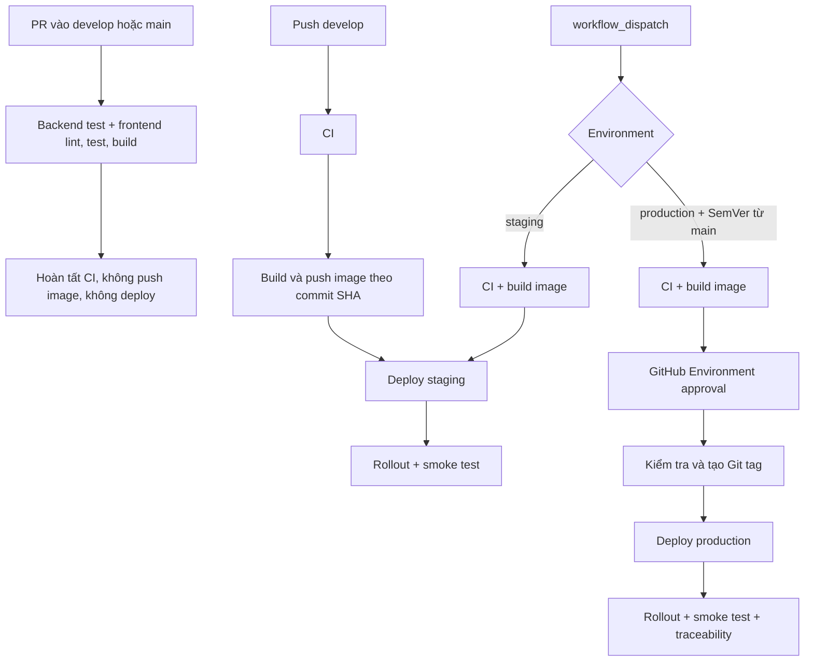

# Luồng CI/CD

Tài liệu này mô tả hành vi chuẩn của `.github/workflows/ci-cd.yml`. Thay đổi trigger,
điều kiện deploy hoặc tên secret phải cập nhật đồng thời tài liệu này.

## Ma trận kích hoạt

| Sự kiện | CI | Build và push image | Deploy |
|---|---:|---:|---|
| Pull request vào `develop` hoặc `main` | Có | Không | Không |
| Push vào `develop` | Có | Có | Tự động lên `staging` |
| Chạy thủ công, chọn `staging` | Có | Có | `staging` |
| Chạy thủ công từ `main`, chọn `production` và nhập version | Có | Có | `production`, sau khi được duyệt |

Push trực tiếp vào `main`, `release/*`, `hotfix/*` hoặc `test` không tự deploy.
Production không được suy luận từ commit message và chỉ được chạy từ `main`.



## Các cổng kiểm soát

1. Backend chạy `./mvnw clean test` với profile `test`.
2. Frontend chạy `npm ci`, lint, Vitest và build.
3. Job build chỉ chạy sau khi cả hai phần trên thành công.
4. Kubernetes luôn deploy image bất biến `:<github.sha>`; các tag `develop`,
   `staging`, `production` chỉ là tag thuận tiện.
5. Deploy dừng ngay nếu thiếu `backend-secrets`, `ghcr-secret`, manifest hoặc
   rollout thất bại. Workflow không áp dụng `k8s/secrets.yaml` để tránh đưa giá
   trị mẫu trong repository lên cluster.
6. Sau rollout, workflow kiểm tra `/actuator/health` của backend và trang gốc của
   frontend qua `kubectl port-forward`.
7. Production cần protection rule/reviewer cấu hình trên GitHub Environment
   `production`; workflow không thể tự tạo quy tắc này.

## Version và truy vết

- Staging tự động: `0.0.0-staging.<run_number>`.
- Production: bắt buộc nhập `release_version` đúng `MAJOR.MINOR.PATCH`, ví dụ
  `1.2.0`.
- Production tạo annotated tag `v<release_version>`. Tag đã tồn tại chỉ hợp lệ
  khi trỏ đúng commit đang deploy; workflow không ghi đè tag.
- OCI labels, Kubernetes labels, Git tag và deployment đều liên kết về cùng
  `github.sha`.

## Cấu hình bắt buộc

Mỗi GitHub Environment (`staging`, `production`) cần:

| Secret | Nội dung |
|---|---|
| `KUBECONFIG_B64` | Kubeconfig được mã hóa base64 |
| `KUBE_NAMESPACE` | Không bắt buộc; mặc định là tên environment |

Trong từng namespace của cluster phải có:

- `backend-secrets`: thông tin DB, JWT, SMTP và các secret của backend.
- `ghcr-secret`: image pull secret cho GHCR.

Cluster phải cài ingress controller và cert-manager/ClusterIssuer từ hạ tầng.
Repository hiện không quản lý manifest ClusterIssuer.

## Chạy thủ công

```bash
# Staging
gh workflow run ci-cd.yml -f environment=staging

# Production
gh workflow run ci-cd.yml -f environment=production -f release_version=1.2.0
```

Không chạy production để thử workflow. Dùng pull request để kiểm tra CI và chạy
staging thủ công khi cần xác minh CD.

## Kết quả rà soát local (2026-09-23)

Các lỗi dưới đây tồn tại trên commit gốc của nhánh và không phát sinh từ thay
đổi workflow/tài liệu này:

- Frontend: 456/463 test đạt; 7 test lỗi (6 timeout và 1 assertion dữ liệu).
- Backend: lượt chạy bị giới hạn sau 5 phút; 1.267 test đã có báo cáo, trong đó
  có 5 lỗi H2 do thiếu bảng ở `CodeRangeRepositoryTest` và
  `ShipmentSplitRelationshipRepositoryTest`.

Vì vậy test gate mới sẽ chặn pipeline cho đến khi các lỗi test hiện hữu được xử
lý. Không được bỏ qua test hoặc thêm `continue-on-error` để ép deploy.

## Rollback

Xác định revision và image commit-SHA trước khi rollback:

```bash
kubectl -n production rollout history deployment/backend
kubectl -n production rollout history deployment/frontend
kubectl -n production rollout undo deployment/backend
kubectl -n production rollout undo deployment/frontend
kubectl -n production rollout status deployment/backend --timeout=180s
kubectl -n production rollout status deployment/frontend --timeout=180s
```

Sau rollback phải chạy lại health check, kiểm tra frontend và ghi nhận SHA image
đang hoạt động. Không rollback bằng tag mutable như `production`.
