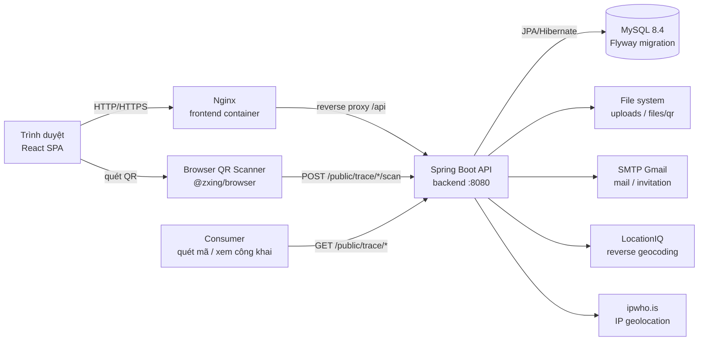
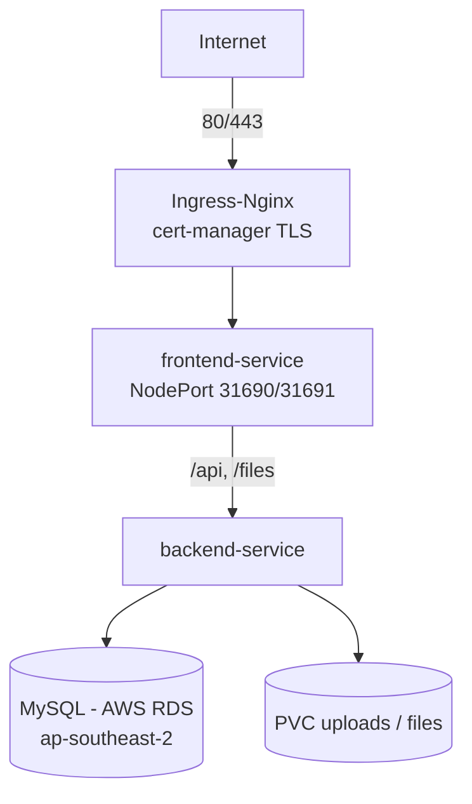
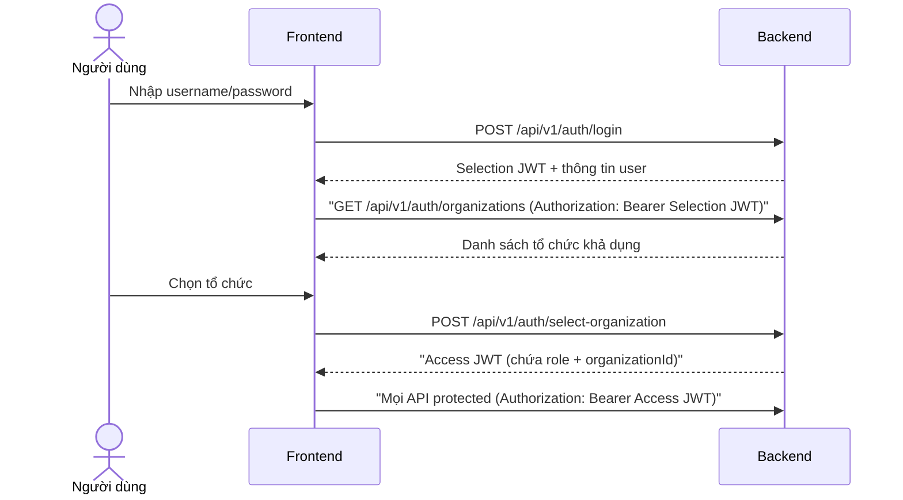
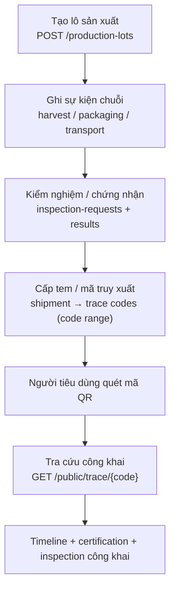

# Kiến trúc Hệ thống — Nguồn Gốc Số

> Mô tả kiến trúc **thực tế** của hệ thống tại commit `4a8d7417`.
> Phần lớn sơ đồ dùng Mermaid (đồng nhất với README hiện có).

- Mã story: **NCL-10-CN-011-CV-05**
- Tham chiếu: [OPERATIONS.md](./OPERATIONS.md), [SECURITY.md](./SECURITY.md),
  [DEPLOYMENT.md](./DEPLOYMENT.md)

---

## 1. Tổng quan kiến trúc



### Kiến trúc runtime Kubernetes (staging/production)



> Khi chạy Docker Compose (`docker-compose.yml`) cụm này đơn giản hóa:
> frontend (Nginx) → backend:8080 → mysql:3306.

---

## 2. Frontend

| Hạng mục | Giá trị thực tế |
|---|---|
| Framework | React 19 + TypeScript (strict) |
| Build | Vite 8 (`tsc -b && vite build`) |
| Routing | React Router v7 (`src/routes/AppRoutes.tsx`) |
| State/Data | React Context (`AuthContext`) + TanStack React Query (`@tanstack/react-query`) |
| UI | Tailwind CSS 4 + shadcn/ui (`components/ui/*`) + Ant Design (antd) |
| Form/Validate | React Hook Form + Zod |
| HTTP | Axios (`src/api/axiosConfig.ts`, interceptor session-expiry) |
| QR | `@zxing/browser` + `html5-qrcode` |
| Test | Vitest + Testing Library (8 test files) |

### Cấu trúc chính

```
src/
├── api/          # 1 module/domain: authApi, farmApi, traceApi, ...
├── components/   # layout (Sidebar, Header), common, dashboard, auth, backup, ...
├── config/       # runtimeConfig, roleAccess (ROLE_ACCESS, getRoleLabel)
├── pages/        # 1 thư mục/trang theo domain
├── routes/       # AppRoutes.tsx (PrivateRoute, RoleRoute)
├── types/        # TypeScript interfaces cho API
└── utils/        # session, storage, validators, formatters
```

### Routing & bảo vệ trang

- `PrivateRoute`: chưa đăng nhập → redirect `/login`.
- `RoleRoute` (`components/auth/RoleBasedRoute.tsx`): không đủ role → redirect `/dashboard`.
- Route công khai: `/`, `/public/trace/:codeValue` (không cần đăng nhập).

---

## 3. Backend

Spring Boot 3.5.16, Java 21, package gốc `vn.nguongocso`.

```
backend/src/main/java/vn/nguongocso/
├── auth/          # Đăng nhập, JWT, forgot/reset password, account lock, login anomaly
├── organization/  # Tổ chức, thành viên, invitation, hồ sơ tổ chức
├── permission/    # RBAC: PermissionChecker, role-permission mapping
├── farm/          # Vùng trồng, lô sản xuất, nhật ký canh tác, vật tư, đơn vị hành chính
├── event/         # Chain event: harvest, packaging, preprocessing, transport, procurement, warehouse
├── trace/         # Shipment, TraceCode, QR, recall, label export/cancel, suspect detection
├── certification/ # Chứng nhận, tiêu chuẩn, yêu cầu kiểm nghiệm, kết quả kiểm nghiệm
├── publicapi/     # Tra cứu công khai + partner API (API key gateway)
├── report/        # Dashboard, thống kê tra cứu, phân tích vùng trồng, hồ sơ GS1, báo cáo ngành
├── alert/         # Cảnh báo, scan anomaly, activity log
├── notification/  # Thông báo trong hệ thống
├── backup/        # Sao lưu/phục hồi + scheduler
├── export/        # Xuất dữ liệu mở (open data)
├── mail/          # Gửi email (SMTP)
├── integration/   # apikey + partner
├── help/          # Nội dung hướng dẫn in-app
├── common/        # ApiResult, PageResponse, aspect, utils
└── config/        # SecurityConfig, JWT filter, API key filter, maintenance filter, TimeConfig, WebConfig
```

### Phân tầng chuẩn

```
Controller → Service (interface + impl) → Repository (Spring Data JPA)
                        │
                        ├── Event/Listener (Spring Application Events)
                        ├── @PreAuthorize + PermissionChecker (RBAC)
                        └── DTO (request/response) — validation qua jakarta.validation
```

---

## 4. Database

- **MySQL 8.4** (compose) / 8.x RDS (k8s).
- **Flyway** quản lý schema: 58 file migration (schema + data), chạy lúc backend khởi động.
- Hibernate: `ddl-auto=validate` (không auto-create).
- Ảnh QR lưu **file** trên filesystem, đường dẫn trong DB; upload attachments lưu filesystem.

### Bảng chính (từ migration `schema/`)

| Nhóm | Bảng |
|---|---|
| Auth/RBAC | `roles`, `permissions`, `organizations`, `users`, `organization_users`, `invitations`, `role_permissions`, `organization_role_permissions`, `password_reset_tokens` |
| Nông nghiệp | `product_categories`, `farm_areas`, `production_lot`, `farm_logs`, `farm_log_attachments`, `lot_assignments`, `administrative_units`, `area_assignments`, `input_materials` |
| Chuỗi cung ứng | `shipments`, `trace_codes`, `code_ranges`, `chain_events`, `label_export_history`, `label_cancellation_history`, `recalls`, `recall_requests`, `warehouse_receipts` |
| Kiểm nghiệm | `certifications`, `standards`, `inspection_requests`, `inspection_criteria`, `inspection_criterion_definitions`, `inspection_criterion_results`, `testing_units`, `accreditation_scopes` |
| Giám sát/vận hành | `activity_logs`, `login_attempts`, `login_anomalies`, `suspicious_cases`, `backup_restore_history`, `backup_schedules`, `scan_logs`, `metrics_buffers`, `export_history`, `help_content`, `partner_api_keys`, `notifications` |

> Chi tiết cột trong từng file `backend/src/main/resources/db/migration/schema/V*__*.sql`.

---

## 5. Authentication

Luồng xác thực gồm **2 bước** (xác minh từ `AuthController`/`AuthContext`):



- 2 loại token: **ORG_SELECTION** (bước chọn tổ chức) và **ACCESS**.
- `POST /api/v1/auth/switch-organization` cho phép chuyển tổ chức khi đã đăng nhập.
- Password hash: **BCrypt**; JWT sign: **jjwt 0.12.6**.

---

## 6. Authorization & RBAC

### 6.1 Hai lớp kiểm soát

1. **`@PreAuthorize("hasRole('VT-xx')")`** — Spring Security, theo role của người dùng.
2. **`PermissionChecker.check("resource", "action")`** — kiểm tra permission động:
   - Permission mặc định của role (`role_permissions`).
   - Ghi đè theo tổ chức (`organization_role_permissions`) — cho phép HTX bật/tắt từng quyền của vai trò.

### 6.2 Các vai trò

| Code | Tên | Vai trò (frontend `getRoleLabel`) |
|---|---|---|
| VT-01 | ADMIN | Quản trị viên hệ thống |
| VT-02 | ORG_MANAGER | Quản lý hợp tác xã |
| VT-03 | EVENT_RECORDER | Người ghi sự kiện |
| VT-04 | PROCUREMENT | Doanh nghiệp thu mua |
| VT-05 | REGULATOR | Cán bộ quản lý ngành |
| VT-06 | CONSUMER | Người dùng hệ thống (tra cứu công khai) |

### 6.3 Các resource permission chính (V15)

`organization`, `farm_area`, `production_lot`, `farm_log`, `shipment`,
`trace_code`, `chain_event`, `certification`, `standard`, `product_category`,
`organization_user`, `role_permission`, `notification`, `alert`, `report`,
`scan_statistics`, `activity_log`, `product_feedback`, `code_range`,
`traceability`, `recall`, `export`, `user` — mỗi resource với các action
(CREATE/READ/UPDATE/DELETE/APPROVE/ACTIVATE/VERIFY/EXPORT...).

---

## 7. Multi-tenant (theo tổ chức)

- Mỗi người dùng thuộc 1+ tổ chức qua `organization_users` (kèm role).
- Access JWT chứa `organizationId`; service truy vấn luôn lọc theo tổ chức
  (vd: `ProductionLotService`, `ShipmentService`...).
- Báo cáo VT-05 (cán bộ ngành) giới hạn theo **phân công địa bàn**
  (`area_assignments` + `administrative_units`) — không fallback toàn bộ dữ liệu.
- `PermissionChecker` dùng `organizationId` hiện tại của user để áp override.

---

## 8. Main Modules & API chính

### 8.1 API nghỉ (REST) — prefix `/api/v1`

| Module | Ví dụ endpoint |
|---|---|
| Auth | `POST /api/v1/auth/login`, `POST /api/v1/auth/select-organization`, `POST /api/v1/auth/switch-organization`, `GET /api/v1/auth/my-organizations` |
| Production lot | `POST /api/v1/production-lots`, `GET /api/v1/production-lots`, `PUT /api/v1/production-lots/{id}`, `POST /{id}/submit`, `POST /{id}/approve` |
| Chain event | `POST /api/v1/chain-events/*` (harvest, packaging, preprocessing, transport), timeline |
| Shipment/Trace | `POST /api/v1/shipments`, tạo trace code từ code range, kích hoạt tem |
| Certification | `GET /api/v1/production-lots/{lotId}/certifications`, `GET /production-lots/{lotId}/test-criteria`, inspection-requests |
| Public | `GET /api/v1/public/trace/{code}`, `POST /api/v1/public/trace/{code}/scan`, `GET /{code}/certifications`, `GET /{code}/inspections` |
| Partner | `GET /api/v1/partner/trace/{code}` (API key gateway) |
| Backup | `/api/v1/backups/*` (VT-01) — schedules, trigger, history, restore |
| Report | `/api/v1/reports/*` — dashboard lô, thống kê tra cứu, phân tích vùng trồng, hồ sơ GS1 |

> Đầy đủ API contract theo từng module: `docs/api/**` (đã có ~45 file).

### 8.2 ApiResult

Mọi response bọc chuẩn `ApiResult<T>`: `{ success, status, data, message, timestamp }`
(`backend/src/main/java/vn/nguongocso/common/ApiResult.java`). Trang dùng
`PageResponse` đã chuẩn hóa (`@EnableSpringDataWebSupport(VIA_DTO)`).

---

## 9. Luồng dữ liệu quan trọng

### 9.1 TC-01 — Luồng truy xuất nguồn gốc (from farm to consumer)



### 9.2 Luồng quét QR & ghi nhận lượt quét

- `PublicHomePage` quét QR bằng `@zxing/browser` → `POST /public/trace/{code}/scan`
  (tạo `TraceCodeScanLog`, kích hoạt phát hiện bất thường) → chuyển kết quả qua router state.
- Load lại/thủ công → `GET /public/trace/{code}` (đọc thuần, không tạo scan log).
- Backend reverse-geocoding qua **LocationIQ** khi có tọa độ.

### 9.3 Sao lưu & phục hồi

- `BackupService` gọi `mysqldump`; `RestoreService` gọi `mysql`.
- Restore nâng **maintenance mode** (MaintenanceFilter chặn, trả 503) cho tới khi xong.
- Composer: `@EnableScheduling` + `BackupSchedule` (cron expression).

---

## 10. NOT VERIFIED

- Hành vi thực tế của cluster k8s (k3s) tại staging/production.
- Chi tiết một số API contract phụ chưa có file `docs/api/**` tương ứng.